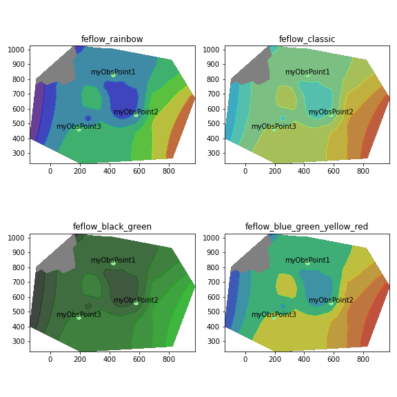

# ifm_contrib

## Description

*ifm_contrib* is an Open-Source Extension of the IFM, the Python API of the groundwater modellierung software [FEFLOW](https://en.wikipedia.org/wiki/FEFLOW) by [DHI](https://www.dhigroup.com).

It extents the namespace of the classic IFM to facilitate using FEFLOW in combination with the popular Python datascience libraries [pandas](https://pandas.pydata.org), [geopandas](https://geopandas.org) and [matplotlib](https://matplotlib.org).

The `ifm_contrib` namespace is a superset of the classic `ifm` namespace, thus scripts written for the latter will be back-wards compatible and only one library import statement is required.

## Project status

The library has been developed since 2019, and reached maturity around 2021 with most features for (geo-)pandas as matplotlib integration in place.

`ifm_contrib` is published under the MIT license. It is free to use, share and modify. Users are encouraged to contribute their own code back to the project.

Please note that the maintainer of this project is not associated with DHI.

## Development setup

- Clone this repo
- Inside the repo:

  ```bash
  python -m venv .venv
  source .venv/bin/activate
  pip install -e ".[test]"
  ```

- Run unit test with `pytest`

If you want to create the documentation:

```bash
source .venv/bin/activate
pip install -e ".[test,doc]"
cd doc/sphinx
make html
# Open doc/sphinx/build/html/index.html in a browser
```

## Installation

The recommended way of installing `ifm_contrib` is by copying or cloning the repository directly into the FEFLOW program director next to the classic IFM.

Installation via `pip` should be done by:
```bash
pip install https://github.com/red5alex/ifm_contrib/archive/refs/heads/master.zip
```

An installation of FEFLOW (version 7.2 or higher) is required.

## Getting started

**For a detailed introduction and installation notes, see [ifm_contrib: An Introduction](./doc/Notebooks/getting_started.ipynb)**

Its not a pretty one, but you can find an (unregularly updated) help system including API reference here](https://red5alex.github.io/ifm_contrib/ifm_contrib.contrib_lib.html).

## Troubleshooting and Contribution

If you run into issues please open an [issue](https://github.com/red5alex/ifm_contrib/issues). Please note that the maintainer may not dedicate significant time to the project at this time but will try its best to respond.

## Gallery

### Visualize FEFLOW Results directly in Jupyter

Create inline plots with the look-and-feel of FEFLOWs directly within Jupyter. The plots can be exported as GeoDataFrames and saved to shape-files easily. \
*ifm_contrib* adds light support for coordinate systems to FEFLOW.



### Process FEFLOWs Time Series with Pandas

Time Series (aka Power functions) and History charts can be easily exported to pandas DataFrames. Automatic conversion to DateTime based on FEFLOWs Reference Time. In-Built Synchronization to observation point reference data.


### Pandas-access to Nodal and Elemntal Data, Multi-Layer Wells, and much more

Read more in [ifm_contrib: An Introduction](./doc/Notebooks/getting_started.ipynb)
